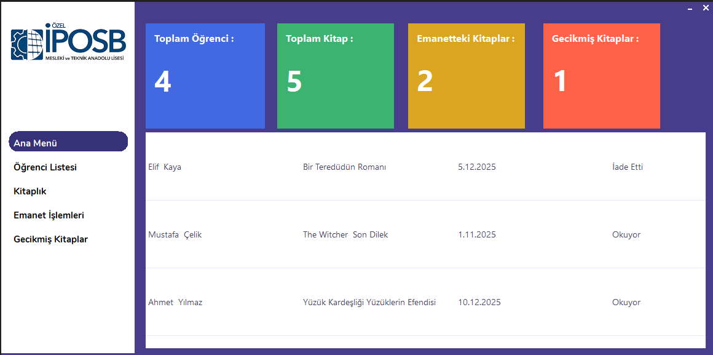
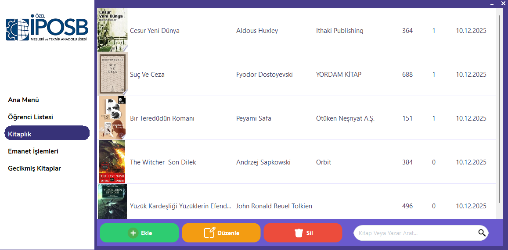
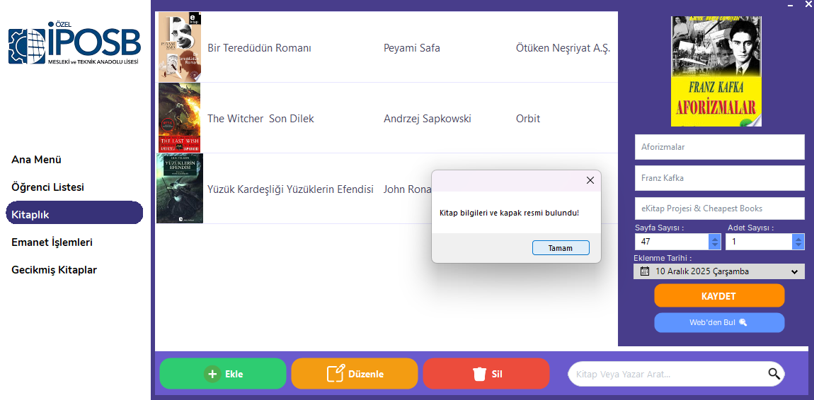
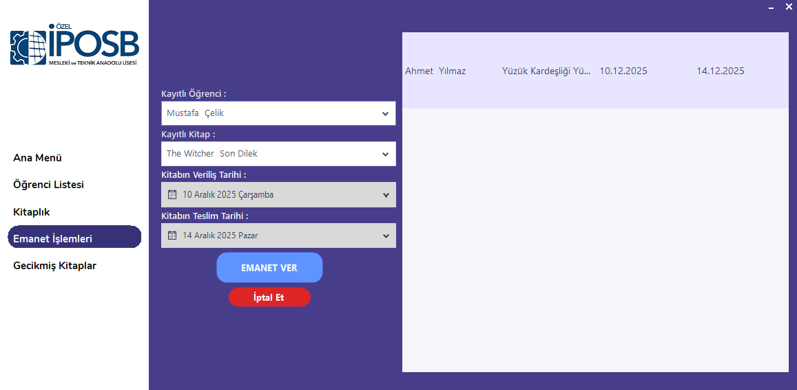

# 📚  Kütüphane Otomasyon Sistemi

C# Windows Forms kullanılarak geliştirilmiş, kullanıcı dostu ve modern arayüze sahip bir kütüphane yönetim sistemi. Kitap kayıtlarını tutmanın yanı sıra **Google Books API** entegrasyonu sayesinde kitap bilgilerini ve kapak fotoğraflarını internetten otomatik olarak çeker.

## 🚀 Özellikler

- **🔍 Google API Entegrasyonu:** Kitap adını yazdığınızda "Webden Bul" butonu ile yazar, yayınevi, sayfa sayısı ve **kapak fotoğrafını** otomatik getirir.
- **🖼️ Görsel Kitaplık:** Kitaplar listelenirken kapak fotoğrafları, stok durumu ve detaylar şık bir tablo tasarımında görüntülenir.
- **📝 Stok ve Kayıt Yönetimi:**
  - Kitap Ekleme, Silme ve Güncelleme (CRUD işlemleri).
  - Stok takibi.
- **🎨 Modern Arayüz:** Standart Windows görünümü yerine modern UI elementleri ve özelleştirilmiş DataGridView tasarımı.
- **📂 Veritabanı:** Microsoft Access (.mdb) tabanlı taşınabilir veritabanı yapısı.

## 🛠️ Kullanılan Teknolojiler ve Kütüphaneler

- **Dil:** C# (.NET Framework)
- **Arayüz:** Windows Forms (WinForms) & Guna UI 2 (Modern tasarım için)
- **Veritabanı:** MS Access (OLEDB)
- **Veri Formatı:** JSON (Google API verileri için)
- **Kütüphaneler:**
  - `Newtonsoft.Json` (API'den gelen veriyi işlemek için)
  - `System.Data.OleDb`

## 💻 Kurulum ve Kullanım

1. Projeyi bilgisayarınıza indirin (Download ZIP veya Clone).
2. Klasör içerisindeki `.exe` dosyasını çalıştırın.
3. **Not:** Veritabanı bağlantısının sorunsuz çalışması için `Kutuphane.mdb` dosyası `.exe` ile aynı klasörde bulunmalıdır.

## 📷 Ekran Görüntüleri

| Kitap Listesi | Kitap Ekleme & API |
| :---: | :---: |
|  |  |
| Gecikmiş Kitaplar | Kitap Emanet Etme / İade Alma|
| :---: | :---: |
|  |  |

